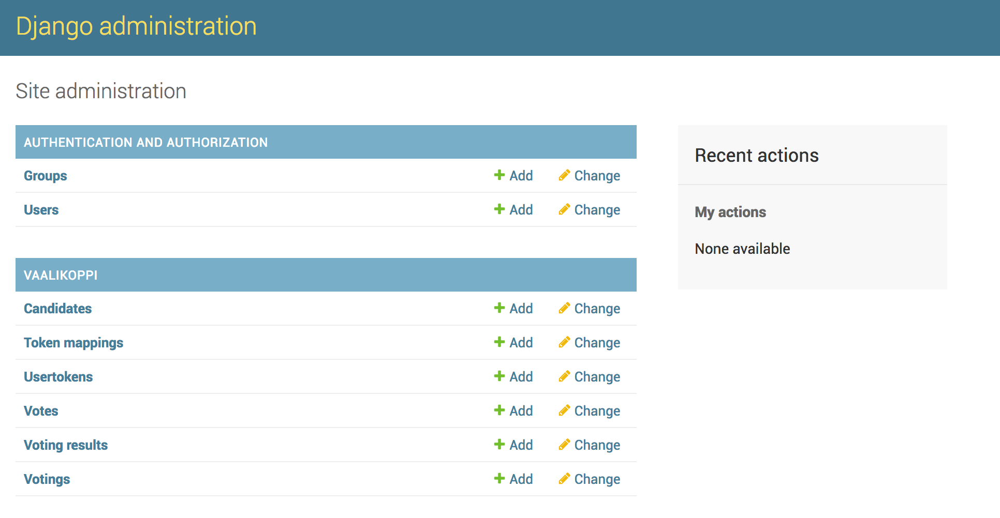

# Prodeko äänestyskilke :bookmark:

## Lokaaliajo

Vaatimukset:

- [Docker](https://www.docker.com/)

```bash
$ docker-compose up
```

Tämän jälkeen sivusto pitäisi olla nähtävissä osoitteessa http://localhost:8000/vaalikoppi/.

Admin näkymään pääsee osoitteesta http://localhost:8000/vaalikoppi/admin/votings/


## Äänestysoikeuden myöntäminen ja verifikaatio

Äänestystilaan saapuessa ihmisiltä tarkistaan heidän jäsenyytensä voimassaolo ja heille jaetaan kertakäyttöinen 6-merkkinen koodi, jolla kukin pystyy kirjautumaan äänestysjärjestelmään. Kertakäyttökoodit järjestelmään saa printattua järjestelmän backendistä (jokaisella generointi kerralla syntyy 100 uutta koodia). Koodeja jaettaessa kukin koodi tulee aktivoida äänestyskelpoiseksi järjestelmän backendistä. Muuten koodeilla ei pysty kirjautumaan sisään.

## Äänestäminen

Kirjautumalla järjestelmään jäsenet pääsevät osallistumaan äänestyksiin. Yksi koodi oikeuttaa yhteen ääneen kussakin äänestyksessä ellei äänestyksessä äänestetä tiimin kokoonpanosta, jolloin koodi oikeuttaa äänestyksessä määrättyyn määrään ääniä. Äänestäessä järjestelmä varmistaa vielä, että henkilö on varmasti valinnut haluamansa kandidaatin vahinkoklikkausten välttämiseksi. Jos henkilö ei pysty kirjautumaan saamallaan koodilla järjestelmään, on koodi pahimmassa tapauksessa käytössä jossain muualla. Tällöin on kaikki koodit deaktivoitava sekä jaettava uudet.

## Äänioikeuden poistaminen ja yleiset äänestyspisteet

Henkilön poistuessa tilasta - esimerkiksi vessaan - hänen koodinsa deaktivoidaan, jotta äänestäminen tilan ulkopuolelta estetään. Henkilö pystyy tarkistamaan koodinsa painammalla perusnäkymän yläpalkin sormenjälkeä. Ongelmien ilmetessä on hyvä päivittää sivu ja yrittää uudestaan. Jotta äänestystilaan voidaan järjestää yhteiskäyttöön äänestyspisteitä (läppäreitä tai kännyköitä), jokainen käyttäjä pystyy myös kirjautumaan ulos. Siksi onkin aiheellista, että kukin pitää saamansa koodin tallessa, koska kirjautuminen samalla tunnuksella takaisin ilman koodia on käytännössä mahdotonta (koodit eivät ole linkattu jakamisvaiheessa henkilöihin vaalisalaisuuden vaalimiseksi). Yhteiskäyttöpisteillä kukin käyttäjä kirjautuu järjestelmään sisään, äänestää ja kirjautuu ulos, jolloin piste vapautuu seuraavalle käyttäjälle.

## Äänestysten luominen

Äänestyksiä luodaan backendistä. Backendistä voi määrittää luonnollisesti kunkin äänestyksen ehdokkaat sekä käytettävien äänten määrän (kuinka monta ehdokasta valitaan). Äänestykset voivat olla kolmessa tilassa:

- Avaamattomia: Ehdokkaat ovat näkyvillä, mutta heitä ei voi vielä äänestää
- Avoimia: Ehdokkaita voi äänestää
- Suljettuja: Vain voittanut ehdokas on näkyvillä ja tulokseen ei luonnollisesti voi enää vaikuttaa. Tulokset tulevat näkyville kaikille samaan aikaan.

Äänestyksen suljettua järjestelmä järjestää ehdokkaat äänijakauman mukaan järjestykseen. Tasapelin tai vastaavan tilanteen sattuessa luodaan uusi äänestys, jossa jatkoon valitut ehdokkaat ovat ehdolla.

## Vaalisalaisuus ja yksityisyys

Järjestelmä perustuu pitkälti siihen, että aktiivisten koodien määrä vastaa salissa olevien henkilöiden määrää. Jos näin ei ole, tulee tilanne joko selvittää ja tarvittaessa kaikki koodit deaktivoida ja jakaa uudet. Järjestelmä on suunniteltu tietorakenteltaan niin, että annettuja ääniä ei voi yhdistää jaettuihin koodeihin, jotta kunkin äänestäjän nimettömyydestä voidaan olla varmoja. Järjestelmästä näkee kuitenkin, kuinka monta ääntä on jaettu. Äänestykset suljetaan vasta, kun kaikki salissa olevat ovat jakaneet äänensä.

## Mahdolliset ongelmatilanteet

Teoreettisesti kuka tahansa henkilö voi luovuttaa koodinsa tilan ulkopuolelle. Tämä vastaa kuitenkin tilannetta, jossa joku sanelee toiselle ihmiselle, ketä äänestää. Joka tapauksessa annettujen äänien määrän tulisi vastata tilassa olevien henkilöiden määrää ja siten aktiivisten koodien määrää.

Ongelmatapauksissa tai kysymyksissä ota yhteyttä Prodekon Mediakeisariin mediakeisari@prodeko.org!
